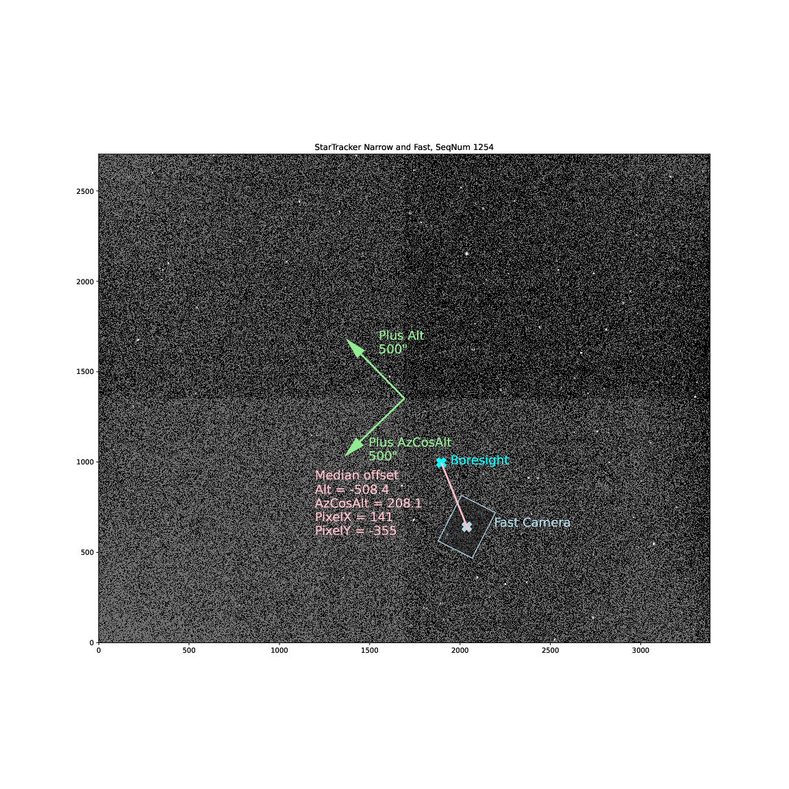

:tocdepth: 1

.. sectnum::

.. Metadata such as the title, authors, and description are set in metadata.yaml

.. TODO: Delete the note below before merging new content to the main branch.

.. note::

   **This technote is a work-in-progress.**

Abstract
========

There are three StarTracker cameras mounted on the Rubin Observatory TMA (Telescope Mount Assembly).  This technote describes the offsets necessary to center images in the fast camera.

Introduction
================

There are three StarTracker cameras mounted on the Rubin Observatory TMA(TelescopeMount Assembly).  These are used to verify the pointing and tracking performance of the TMA before the telescope mirrors are installed.  The wide camera has a field of view of about 7 degrees and a pixel scale of 8.66 arcseconds/pixel.  The narrow camera has a field of view of about 1.2 degrees and a pixel scale of 1.44 arcseconds/pixel.  The fast camera is a DIMM unit that currently has the deflection prism removed.  It has a fast camera that can take images at hundreds of hertz.  It has a small field of view of about 6 arcminutes and a pixel scale of 0.62 arcseconds/pixel.

The current pointing model for the TMA has been developed primarly using the narrow camera.  So when the TMA is directed to slew to a location on the sky, it directs that location to the boresight of the narrow camera.  Because the field of view of the fast camera is so small, an object placed at the boresight of the narrow camera is outside of the field of view of the narrow camera (see Figures 2 and 3).  We typically want to take high speed camera images with a bright star in the fast camera field of view.  Spiral searching to find a bright star and put it in the fast camera field is laborious.  So what is wanted is to know the offset from the narrow camera to the fast camera.  Then the procedure is to point the TMA at an object, which will position it at the boresight of the narrow camera, and then introduce a known offset to put the object in the field of view of the narrow camera.  Calculating and verifying this offset is the subject of this technote.

Analysis
================

The analysis and plots shown here were done using the notebook at:
https://github.com/craiglagegit/Notebook_Keeper/blob/main/summit_notebooks/StarTracker_Fast_Offsets_05Apr23.ipynb

The first step is to determine the offsets using the astrometry solutions as determined by RubinTV. FInding an astrometry solution for the fast camera images is difficult because the field of view is so small and it often doesn't contain enough stars to give a good astrometric solution.  Using images from the night of 21-Mar-2023, Merlin FIsher-Levine was able to obtain simultaneous narrow camera and fast camera astrometric solutions for several hundred images.  We can then calculate the offset from the boresight of the narrow camera to the center of the fast camera.  Note that, since these are offsets on the sky, we need to include a cos(elevation) factor in the azimuth offset.  figure 1 shows these calculated offsets.

Figure 1.  Astrometric Narrow camera to Fast camera offsets from the night of 21-Mar-23.

Figures 2 and 3 were created to check these offsets.  Each one is a pair of narrow/fast camera images from the night of 21-Mar-23.  The calculated offsets from Figure 1 are verified.

Figure 2.  Offset verification on SeqNum 1160 from 2023-03-21.

Figure 3.  Offset verification on SeqNum 1254 from 2023-03-21.

Verification on sky
=========================

The analysis above shows that the offset from the narrow camera to the fast camera is Az = +208 arseconds, Alt = -508 arcseconds.  This is to move from the narrow camera boresight to the center of the fast camera. However, when we offset the telescope using the ``mtcs.offset_azel`` command, this moves the telescope, not the image.  So these values need to be the negative of the values determined above.  Therefore, it was recommended that to center the object in the fast camera, we should slew to the object and then apply the following command: ``mtcs.offset_azel(az=-208, el=508)``.  However, it was found empirically on multiple nights that the sign of the az offset was incorrect, and the command ``mtcs.offset_azel(az=208, el=508)`` successfully put the object in the fast camera field of view, although not always centered.

Possible explanation of the sign error
===========================================

No explanation has been found for the sign error on one component of the offset.  It is easy to understand that the signs of both offsets are incorrect, because there are sign inversions as discussed above.  However, no error could be found in the analysis above that could invert the sign of just one of the components.  So I started looking at the code that runs the ``mtcs.offset_azel`` command.  At this point in the code:

https://github.com/lsst-ts/ts_observatory_control/blob/65e62109e88185f16e08e24683914e08bf5c3119/python/lsst/ts/observatory/control/base_tcs.py#L116

There is the following statement:

..  code-block:: python

    # Parity of x and y axis. These can be 1 or -1 depending on how the
    # x axis in the boresight is aligned with the telescope axis. For
    # instance, Nasmyth angle right has parity 1 and Nasmyth angle left has
    # parity -1, because the x-axis is reversed with respect to optical
    # axis.
    self.parity_x = 1.0
    self.parity_y = 1.0
	

The code that actually does the offset is here:

 https://github.com/lsst-ts/ts_observatory_control/blob/65e62109e88185f16e08e24683914e08bf5c3119/python/lsst/ts/observatory/control/base_tcs.py#L996

 
..  code-block:: python
   
    x, y, _ = np.matmul(
    [self.parity_x * el, self.parity_y * az, 0.0],
    self.rotation_matrix(bore_sight_angle),
    )
    await self.offset_xy(x, y, relative=relative, absorb=True)

So the hypothesis is that one of ``parity_x`` or ``parity_y`` is incorrect and this is what is causing the sign error in the one component.

Summary and future work
===========================================

Through a combination of analysis and empirical testing, it has been found that, after slewing the TMA to an object, it can be placed in the fast camera field of view with the command:  ``mtcs.offset_azel(az=208, el=508)``.

There are two things that are recommended to try when the TMA again becomes operational:

#. Try changing the ``parity_x`` value in the mtcs code to -1.0 to see if this eliminates the problem
#. Try using ``mtcs.offset_xy(x=-141, y=355)`` command.  Does it also have the sign error of one component.  Does it successfuly place the object in the fast camera field at multiple locations on the sky?
	
